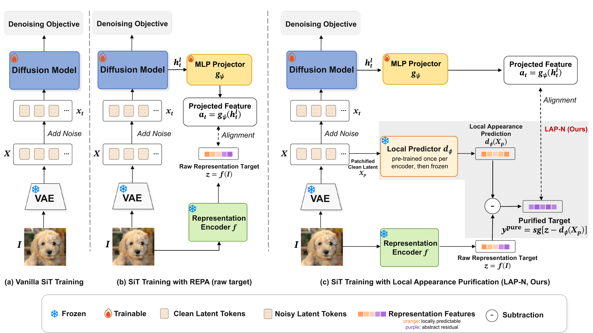

#  [Purify Before You Align: Improving Representation Alignment for Diffusion Models](https://arxiv.org/abs/ARXIV_ID)
By [Yingheng Wang](https://yingheng-wang.com/), Yaoqiang Li, Yaqin Wu, [Junwen Bai](https://junwenbai.github.io/), [Jiatao Gu](https://jiataogu.me/), [Christopher De Sa](https://www.cs.cornell.edu/~cdesa/), [Volodymyr Kuleshov](https://www.cs.cornell.edu/~kuleshov/)

[](https://arxiv.org/abs/ARXIV_ID)
[](https://huggingface.co/yingheng/LAP-checkpoints)
[](https://github.com/yingheng-wang/LAP/actions/workflows/tests.yml)



Representation alignment improves and accelerates diffusion training by matching an intermediate hidden state of the denoiser to a pretrained visual encoder. Which encoder to use is still largely an empirical choice: under the standard recipe, MAE gives much smaller gains than DINOv2 despite carrying more linearly decodable clean-image content. We introduce ***LAP*** (**L**ocal **A**ppearance **P**urification), which removes the part of the target that is predictable from local clean-latent appearance and aligns the denoiser to the residual. LAP changes only the alignment target; the denoising objective, architecture and sampler stay the same, so there is no inference cost. On ImageNet 256×256 with SiT-B/2, LAP reduces the FID of MAE-aligned training from 53.1 to 42.3, improves AIMv2 and CLIP, and largely preserves DINOv2 and DINOv3.

In this repo, we provide:
* **The LAP framework**
  1. **LAP-L**: the target minus its per-batch affine prediction from clean-latent patches (`--target-mode residual`).
  2. **LAP-N**: the target minus a frozen local convolutional purifier, trained once per teacher (`--target-mode purified`).
  3. The constant-readout score C₀, computed before diffusion training, which predicts the gain from purification.
* **Baselines and compositions**
  1. REPA with five teachers (MAE, AIMv2, CLIP, DINOv3, DINOv2), plus eight more encoders for the C₀ sweep.
  2. iREPA-style projector and normalization, VA-REPA, REG, and sREPA, each with and without LAP.
  3. Frozen EQ-VAE and REPA-E VAE tokenizers, RESISC45 and AID, larger batches and models.
* **Analysis tools**: image-disjoint probes of presence, velocity sufficiency and causal use; a purifier class-information audit; the development proxy FID.
* **Checkpoints**: five SiT-B/2 models and all 12 purifiers on [Hugging Face](https://huggingface.co/yingheng/LAP-checkpoints).

## Main Results

FID-50K (↓) on ImageNet 256×256: SiT-B/2, 400K steps, batch 64, no guidance, mean over two training seeds. Without alignment, FID is 53.92.

| Teacher | REPA (raw target) | + LAP-L | + LAP-N |
|---|---:|---:|---:|
| MAE ViT-L | 53.05 | 45.15 | **42.30** |
| AIMv2 ViT-L | 47.97 | **44.31** | 44.56 |
| CLIP ViT-L | 44.74 | 42.69 | **42.21** |
| DINOv3 ViT-B | 42.73 | **42.07** | 43.27 |
| DINOv2 ViT-B | 41.75 | **41.47** | 42.11 |

Per-seed metrics for every run are in [`configs/experiments.json`](configs/experiments.json).

<a name="code-organization"></a>
## Code Organization
1. ```train.py```: SiT training with representation alignment, LAP targets (`--target-mode`), compositions and swapped VAEs
2. ```loss.py```: Denoising, alignment and composition losses
3. ```train_purifier.py```: LAP-N purifier pre-pass; the module is in ```models/purifier.py```
4. ```models/```: SiT backbone and teacher encoder wrappers
5. ```reproduce.py```: Lists and launches every paper experiment
6. ```configs/```: One recipe per experiment; ```experiments.json``` records seeds, step counts and metrics
7. ```sample.py```, ```samplers.py```: EMA sampling (SDE and ODE) to PNGs and an ADM-format `.npz`
8. ```evaluations/```: ADM FID evaluator with its own `requirements.txt`
9. ```preprocessing/```: Dataset download, VAE encoding and FID reference batches
10. ```analysis/```: Constant-readout score, hidden-state probes, purifier audit and the development proxy FID
11. ```scripts/```: Checkpoint download, result summaries and sweep statistics
12. ```results/```: Archived results behind the paper's figures and tables
13. ```docs/```: [Data preparation](docs/DATA.md) and the [reproduction guide](docs/REPRODUCING.md)

<a name="getting_started"></a>
## Getting Started

Create an environment with the tested dependencies (Python 3.10, PyTorch 2.5.1, CUDA). OpenAI CLIP is installed separately because its `setup.py` needs `pkg_resources`:

```bash
conda create --name lap python=3.10
conda activate lap
pip install -r requirements.txt
pip install "setuptools<81" wheel
pip install --no-build-isolation git+https://github.com/openai/CLIP.git@a1d071733d7111c9c014f024669f959182114e33
python -m unittest discover -s tests
```

Prepare ImageNet as images plus cached SD-VAE latents following [docs/DATA.md](docs/DATA.md), and download the MAE teacher:

```bash
mkdir -p ckpts
curl -fL https://dl.fbaipublicfiles.com/mae/pretrain/mae_pretrain_vit_large.pth -o ckpts/mae_vitl.pth
```

Full 400K-step runs need an A100/H100-class GPU; the online-VAE tokenizer runs do not fit in 16 GB.

### Checkpoints

We release five SiT-B/2 models trained on ImageNet 256×256 for 400K steps, together with the 12 frozen purifiers and the latent statistics of the swapped VAEs, on Hugging Face 🤗: [yingheng/LAP-checkpoints](https://huggingface.co/yingheng/LAP-checkpoints). For each model we release the seed with the lower FID-50K.

| Model | File | FID-50K |
|---|---|---:|
| No alignment | `diffusion/in1k_vanilla_s1.pt` | 53.90 |
| MAE, REPA | `diffusion/in1k_mae_raw_s1.pt` | 52.41 |
| MAE, LAP-L | `diffusion/in1k_mae_res.pt` | 44.81 |
| MAE, LAP-N | `diffusion/in1k_mae_lapk5_s1.pt` | 41.53 |
| DINOv2, REPA | `diffusion/in1k_repa_s1.pt` | 41.35 |

```bash
python scripts/download_checkpoints.py --output checkpoints   # verifies SHA256
cp checkpoints/assets/*.pt assets/                              # purifiers for LAP-N training
```

## Reproducing Experiments

Below, we describe how to reproduce the experiments in the paper. The main entry point is [`reproduce.py`](reproduce.py): each experiment is a recipe in [`configs/`](configs) plus a seed, and `reproduce.py` turns it into a `train.py`, `train_purifier.py` or `sample.py` command. Pass `--dry-run` to print the command; any extra flags are forwarded.

### Training

```bash
python reproduce.py list --group teachers   # also: recipes, tokenizers, aerial, sweep, scale, mechanism, development

python reproduce.py train in1k_mae_raw      # MAE, raw target (REPA)
python reproduce.py train in1k_mae_res      # MAE + LAP-L
python reproduce.py train in1k_mae_lapk5    # MAE + LAP-N
python reproduce.py train in1k_mae_lapk5_s1 # second seed
```

Configs list only the options that differ from the `train.py` defaults: physical batch 64 on one GPU, alignment after block 8 with coefficient 0.5, 400K steps and SD-VAE latents. Batch 256 uses four gradient-accumulation steps, because LAP-L fits its predictor on each physical batch of 64. Use `--data-dir` to point to a different dataset location.

### Purifier Training

LAP-N needs a frozen purifier in `assets/`. Copy the released ones from the checkpoint bundle, or train one with the paper's arguments:

```bash
python reproduce.py purifier in1k_mae_lapk5   # writes assets/purifier1k_mae_k5.pt
```

### Sampling and FID

```bash
# Released checkpoint; 50K samples written as PNGs and an ADM .npz
python sample.py --ckpt checkpoints/diffusion/in1k_mae_lapk5_s1.pt --out samples/mae_lapn
# Your own training checkpoint (checkpoints from train.py store pickled arguments)
python reproduce.py sample in1k_mae_lapk5 --trusted-legacy
# Multi-GPU sampling
torchrun --standalone --nproc_per_node=4 sample.py --ckpt checkpoints/diffusion/in1k_mae_lapk5_s1.pt --out samples/mae_lapn
```

Sampling follows the paper: EMA weights, Euler–Maruyama SDE with 250 steps, no guidance. FID uses the [ADM evaluator](https://github.com/openai/guided-diffusion/tree/main/evaluations) in a separate TensorFlow environment:

```bash
python3.10 -m venv .venv-eval && .venv-eval/bin/pip install -r evaluations/requirements.txt
.venv-eval/bin/python evaluations/evaluator.py VIRTUAL_imagenet256_labeled.npz samples/mae_lapn.npz
```

Fresh FID estimates differ slightly from the archived ones because sampling noise depends on the number of processes and the batch size. `python scripts/summarize_results.py --group teachers` recomputes the seed means from the archived metrics.

### Diagnostics

The [reproduction guide](docs/REPRODUCING.md) maps every table and figure to its experiment group, explains the experiment names, and gives the commands for the constant-readout score, the hidden-state probes, the purifier audit and the development metric.

## Acknowledgements
This repository was built off of [REPA](https://github.com/sihyun-yu/REPA) and [SiT](https://github.com/willisma/SiT). FID evaluation uses the [ADM evaluation suite](https://github.com/openai/guided-diffusion/tree/main/evaluations), and the teacher wrappers adapt code from [MAE](https://github.com/facebookresearch/mae), [MoCo v3](https://github.com/facebookresearch/moco-v3), [I-JEPA](https://github.com/facebookresearch/ijepa) and [CLIP](https://github.com/openai/CLIP).

## Citation
```bibtex
@article{wang2026purify,
  title   = {Purify Before You Align: Improving Representation Alignment for Diffusion Models},
  author  = {Wang, Yingheng and Li, Yaoqiang and Wu, Yaqin and Bai, Junwen and Gu, Jiatao and De Sa, Christopher and Kuleshov, Volodymyr},
  journal = {arXiv preprint arXiv:ARXIV_ID},
  year    = {2026}
}
```

## License
New code is released under the MIT License. Files adapted from MAE, MoCo v3 and I-JEPA keep their CC BY-NC 4.0 terms; see [LICENSE](LICENSE) and [THIRD_PARTY_NOTICES.md](THIRD_PARTY_NOTICES.md). The released checkpoints are CC BY-NC 4.0. Teacher and VAE weights and the datasets are not covered and must be obtained under their own terms.
